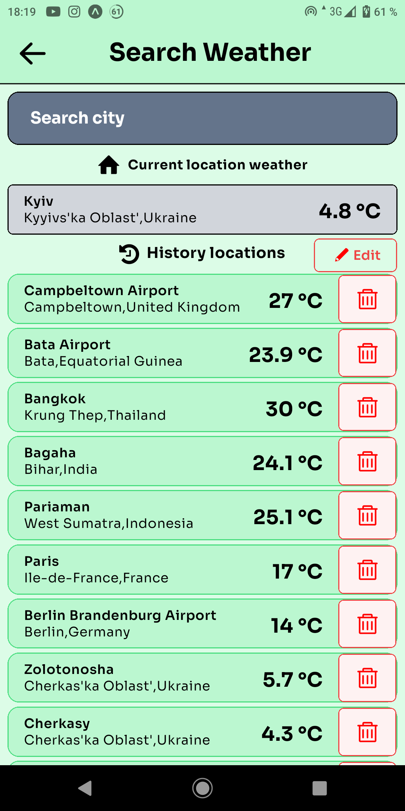

# Project name

Weatherify: Your Personal Weather Assistant

## Description

Weatherify is a mobile application meticulously crafted to offer users a comprehensive suite of weather-related services. Seamlessly blending functionality with user-friendliness, Weatherify boasts an intuitive search feature, facilitating easy access to weather data for diverse locations.

## Features:

- Real-time weather forecasts your current city
- Hourly updates
- Air quality information
- Multi-day forecasts
- Intuitive search functionality
- Search history management
- Customization options for temperature, distance, pressure, and wind speed units
- Storage of preferences and search history using Async Storage

## Installation

1. Make sure you have Node.js installed. If not, you can download it from the official site: https://nodejs.org/
2. Install Expo CLI globally by running the following command from the command line:

npm install -g expo-cli

Change to the project directory and install the dependencies by running the command:

npm install

## Usage

Run the project by running the command:

npm start

Scan the QR code in the Expo Developer Tools console/IDE terminal using the Expo app on your mobile device/camera, or run the project on the emulator by selecting the appropriate option in the console.

## Preview (Expo Go)

[Android]  

[IOS]  

## Screenshots

  
  
  
  
  
  
  
  

